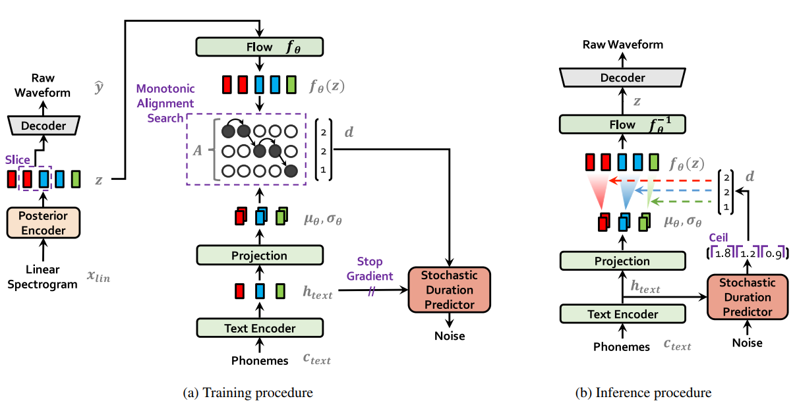

# VITS Model
## 1. Model Architecture


## 2. Pre-requirement Setup
Install all packages
```
pip install -r requirements.txt
```
Setup Monotonic Alignment Search in Cython
```
python ./model/modules/mas/setup.py build_ext --inplace
```

## 3. Command Line
To Train:
```
CUDA_VISIBLE_DEVICES={CUDA_INDEXES} python train.py --train_path {data_path} --tokenizer_path ./tokenizer/vietnamese.json --checkpoint {checkpoint_path} --batch_size {batch_size} --num_epochs {n_epochs}
```
To Infer
```
CUDA_VISIBLE_DEVICES={CUDA_INDEX} python train.py --path {data_path} --tokenizer_path ./tokenizer/vietnamese.json --checkpoint {checkpoint_path} --batch_size {batch_size}
```